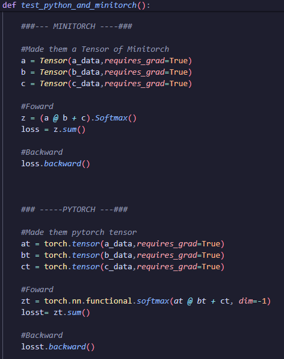
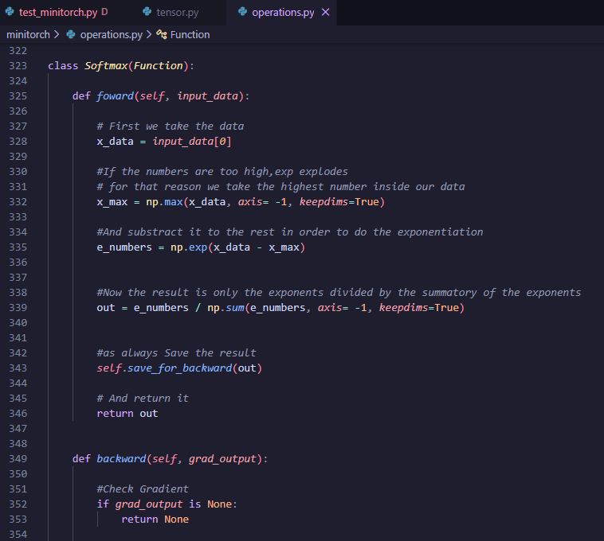
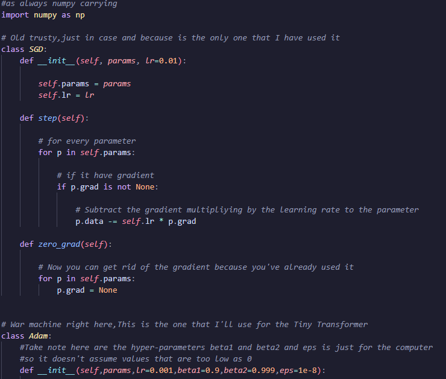
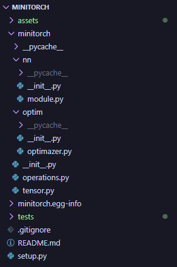

# MINITORCH : A Deep-Learning Engine From Scratch

## DESCRIPTION

This is a Mini-PyTorch using only **NumPy** and validated against **PyTorch**.  
The purpose is learning how PyTorch and the tools often used as "black boxes" works inside.  
Exploring **Computational Graphs**, **Modularity**, **Autograd**, **Topological Sort** and others concepts.  

## WHY?

For future projects I want to use an Autograd Engine to make things easier but I don't like the concept of "black boxes" so, in order to avoid this and as the next logical step in my learning journey I built a Autograd Engine from scratch myself.

>[!NOTE]
>The Project is for **learning purposes only**,Developed in 7 days to test the Goal-driven learning technique on myself.The comparison with PyTorch is only to **Validate** my Minitorch's capabilities.  

## PYTORCH VALIDATION

These are the **Results** after running "**test_minitorch.py**".

The test compare them using **assert_allclose** of Numpy with a toleration of Atol = 1e-6


The coding is similar to **Pytorch**:




>[!NOTE]
> How to run it at the bottom of the README.

## FEATURES

- Automatic Differentiation(**Autograd**)  
- Topological Sorting  
- Numerically Stable Operations  
- Comprehensive Math Suite  
- Professional Optimizers(**SGD**,**Adam**)  
- Modular Architecture  
- PyTorch-Consistent API  

>[!NOTE]
>The Project is **Commented** as an **Step by Step Guide** (Sometimes informal too)







## MINITORCH ARCHITECTURE

The architecture of **Minitorch** is the following:



>[!NOTE]
> The Architecture is modular to make possible new implementations in the near future.

It counts with:  
The "**nn**" folder(**Not implemented** because of the actual purpose of the project).  
The "**Optimizer**" folder(Only **SGD** and **Adam** for now).  
And the files "**tensor.py**" (manages the data and the backward) and "**operations.py**" (manages the mathematical operations).


## PROBLEMS & SOLUTIONS

>[!NOTE]
> During the development of the project I encountered many problems(especially in the test phase),the comments inside are just for explanation of the code,this section focuses in the **opposite**,the journey to reach those solutions.(You can skip it if you're not interested,is mostly "personal").

### THEORY PROBLEMS

Classes and Decorators were new to me at the time that I started the project, making me learn them very fast because of the necessity of using them.In terms of modularity, I didn't have problems because the previous project was in cells(jupyter notebook) but the connection of them was where it confused me the most.At the same time in this project there are so many unnecessary technical words which could slow me down if I didn't have a different approach to the problems.

My solution was first, as previously in the CNN from-scratch project I said that I learn better with analogies,for that reason I started to used them and for that reason I declare that there are so many unnecessary technical words( for example, "Topological Sort", I ended up calling it "make the family tree").Once I understood them the process of imagining the workflow of the project was pretty simple, it made you able to have a little intuition on the next step,in terms of classes and decorators the solution was just brute force,use them as you can until you understand them.  

This made me learn how to break down structural problems and shows me that sometimes simplified things are better than complex ones (at least in this case),and keep doing it even when you don't know because you will learn it at the end.

### CODING PROBLEMS

These are the type of problems that always have a high variance, sometimes you can solve them in 2 seconds or you spend 6 hours and nothing,the second one was the one that happened to me principally in the test phase.I usually can spot my typos in the code (because of the red highlight of VSCode) and fix them right away,but the malicious " _ " didn't show me a red mark.Another problem was working with tuples in the backward,at the end, to finish the cycle you don't have a gradient because is the input origin,but you expect a backward of an operation because those input are used later on in mathematical operations,this was a problem because of the expected tuple output,which at first made me think that the problem was inside the backward of the file tensor.py but was actually in the backward of every mathematical operation inside the file operations.py.

My solution in the first scenario of the underscore was just to spend the literal amount of 6 hours just to find that I put "result._requires_grad" instead of "result.requires_grad" in the apply function, but that curiously was the last problem that I solved,the backward problem was at first where I thought that was the problem so after investigating I found the previously mentioned problem and fixed it with the "check gradient" in every backward of every mathematical function in the file operations.py.

This made me learn the complexity of debugging an entire system and encouraged me to read more times every line that I wrote because of this dependency on just using the red marks of VSCode, a dependecy that I need to change and start doing myself in order to save myself hours.


## HOW TO RUN

### 1. Clone the repository

```bash
git clone https://github.com/NvirAdan/Mini-PyTorch
cd minitorch

```

### 2. Create a Virtual Environment and Activate it(Recommended)

```bash
#Windows
python -m venv venv
./venv/Scripts/activate

#Linux
python3 -m venv venv
source venv/bin/activate

```

### 3. Install dependencies

```bash
pip install numpy torch

```

### 4. Run validation test

```bash
cd test
python test_minitorch.py

```

## LICENSE

This project is licensed under the MIT License - see the [LICENSE](LICENSE) file for details.
